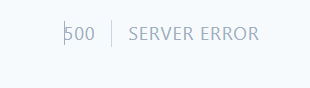

# Getting Started with Create React App

This project was bootstrapped with [Create React App](https://github.com/facebook/create-react-app).

### Instructions to run

- Clone the repo down to your machine.
- Preferably, have yarn installed on the machine, and run `yarn` and `yarn start`
- It should either automatically bring up the app in a tab in your default browser, or you can manually navigate to [localhost:3000](http://localhost:3000/)

### Deveoper Notes

- I chose to use create-react-app as I find it reasonably good for small proof-of-concepts or to play around with some react code.
- I have kept testing fairly minimal. I generally believe in the 'Trophy' testing approach detailed by Kent C Dodds, and I believe my small test shows an example of that.

#### Convert API 500 error

Whilst developing the application, I was attempting to get the /v1/convert API to return, having provided it with the parameters expected in the api documentation.

The server returned a 500 error, which according to the documentation is out-with my control to fix. Due to this, I was not able to get the latter half the of the expected requirements done.
